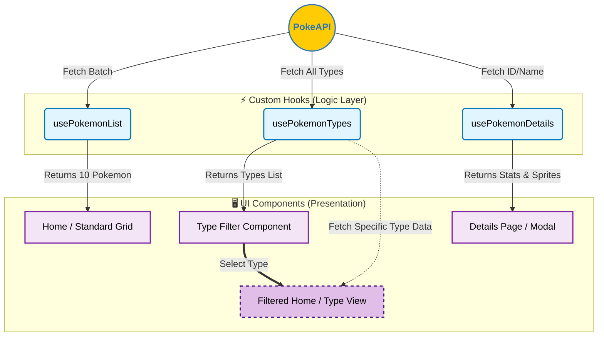

# 📱 Pokedex Application


> A modern, scalable Pokedex application built with Clean Architecture principles, featuring advanced state management and custom hooks.


## 🔍 About the Project

This **Pokedex** was developed not just to display Pokemon data, but to challenge myself in building a robust frontend architecture. The project leverages **React + Vite** and **TypeScript** to ensure type safety and performance.

I focused heavily on **Clean Code** and **Modularity**, separating business logic from UI components through the use of specialized Custom Hooks. The design features a modern "Glassmorphism" aesthetic (GlassButton) and a fully responsive layout.

## ✨ Key Features

* **Advanced Filtering:** Filter Pokemon by their specific elemental types (Fire, Water, Grass, etc.) instantly.
* **Dynamic Pagination:** Loads Pokemon in batches of 10 to ensure optimal performance.
* **Detailed View:** Dedicated page for specific Pokemon stats and information.
* **Modern UI:** Custom UI components including a Glassmorphism button design.
* **Unit Testing:** Code reliability ensured with Jest.

## 🏗️ Custom Hooks & Architecture

One of the main goals of this project was to abstract logic into reusable **Custom Hooks**. This keeps the components clean and focused solely on rendering.

### 1. `usePokemonList` (Pagination)
Handles the fetching of the main list. It implements logic to fetch **10 Pokemon at a time**, managing loading states and pagination offsets efficiently.

### 2. `usePokemonTypes` (Type Filter & Navigation)
Responsible for fetching and managing all available Pokemon types. Upon selection, it triggers the rendering of a **specialized view ("Filtered Home")**, displaying exclusively the Pokemon belonging to that specific elemental type (e.g., a "Fire-only" grid).

### 3. `usePokemonDetails` (Specific Data)
Handles the data fetching for a single, specific Pokemon. It manages the unique URL parameters to retrieve detailed stats, abilities, and sprites for the details page.

## 🛠️ Tech Stack

* **Core:** React, TypeScript, Vite
* **Styling:** Styled Components (CSS-in-JS)
* **State Management:** Context API
* **Routing:** React Router DOM
* **Testing:** Jest
* **Data Source:** [PokeAPI](https://pokeapi.co/)

## 🚀 Getting Started

To run this project locally, follow these steps:

### Prerequisites
Make sure you have **Node.js** installed.

### Installation

1. Clone the repository:
  ```bash
   git clone [https://github.com/your-username/your-repo-name.git](https://github.com/your-username/your-repo-name.git)

2. Install dependencies:

    npm install

3. Run the development server:

    npm run dev

4. Run Tests :
    npm run test
```

### Data Flow Architecture


<p align="center"> Made with  by <a href="https://github.com/IsraelPina32">Israel Pina</a> </p>
